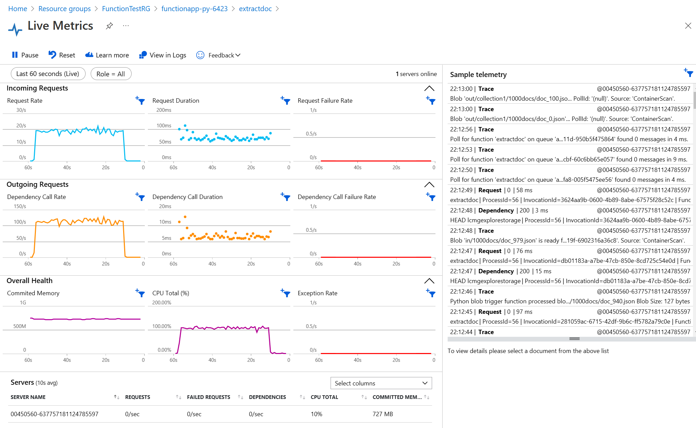

# Example Azure Function (python) to copy and manipulate json files

This blobTrigger function monitors a storage location for incoming files.

When triggered by a file landing in the configured storage location, the `extractdoc` function reads the contents, demonstrates an example of how to reshape that content, and writes the new content out to a different storage location. 

This particular example is inspired by working with the change feed from MongoDB Atlas, and focusses on extracting escaped stringified json from the json documents.

**Goal 1:**

Given documents of the format 
```json
    {
        "namespace": "{\"collectionName\":\"collection1\"}",
        "fullDocument":"{\"foo\": 15}"
    }
```
store a new document containing a json object parsed from the contents of the `fullDocument` item.

**Goal 2:**

The code also demonstrates the configuration of multiple output locations, so that files can we written in a differentiated manner depending on content within the separate `namespace` attribute of the original file. 


```
# in file /out/collection1/<filename>.json:
    {
        "foo": 15
    }
```

> Note: We do not change the original filename. This implementation has limited capability for changing the original filename. There is a simple expression syntax for extracting parts of the filename where there are consistent patterns, and these parts can be assembled into a new filename pattern along with string constants. 


## QuickStart: Run Locally

To test the function locally:

1. Clone or download this repo

    ```
    git clone <clone link>
    cd <repo folder>
    ```
2. Install the Azure Function Core Tools

   - Use this [guide](https://docs.microsoft.com/en-us/azure/azure-functions/functions-run-local?tabs=v3%2Clinux%2Cpython%2Cportal%2Cbash%2Ckeda) and note that this example uses v3.
   - verify installation with 
    ```
    func version
    #--> 3.x.x
    ```

3. copy the [./sample-local.settings.json](./smaple-local.settings.json) file into a file named `local.settings.json, and add storage account connection strings to the AzureWebJobsStorage item, and to the LANDING_ZONE item. 
   - The `AzureWebJobsStorage` connection is a utility storage account: a $web container will be created in that storage account that the function app will use to manage executions
   - the `LANDING_ZONE` connection is a custom storage account connection to the account that the function needs to monitor for incoming files. The naming of this parameter is custom, and needs to match that used in the connection parameter in the [binding configuration](./extractdoc/function.json) for the function. 
   - The connection strings do not need to be different, i.e. the data storage account can double as the utility storage account. 

4. start the function locally
    ```
    func start
    ```

5. Upload a json file to the monitored location. 

   - For the code to work as-is, create a container named `changefeedtest` in your LANDING_ZONE storage account, and upload a file to a folder named `in` within that. 
   - Since this example is inspired by a Mongo DB change feed example, the file should contain the following at minimum:

    ```json
    {
        "namespace": "{\"collectionName\":\"collection1\"}",
        "fullDocument":"{\"foo\": 15}"
    }
    ```
   - see the [./testdata/functional](./testdata/functional) folder for more examples.

6. Review the output location

   - Transformed files will be copied into the `out` folder in the `changefeedtest` container. 


## Quickstart: Deploy

Pre-requisites: 
- Azure CLI installed and set to the correct subscription
- Azure Function core tools installed (see above)
- This repo downloaded and available locally

1. Create the required Azure resources

    Using the Azure CLI (adapted for python from [source](https://docs.microsoft.com/en-us/azure/azure-functions/scripts/functions-cli-create-serverless#sample-script)):
    
    ```bash
    #!/bin/bash

    # Function app and storage account names must be unique.
    newResourceGroup=FunctionTestRG
    storageName=utilitystorage$RANDOM
    functionAppName=functionapp-py-$RANDOM
    region=uksouth

    # Create a resource group.

    az group create --name $newResourceGroup --location $region

    # Create an Azure storage account in the resource group.
    az storage account create \
    --name $storageName \
    --location $region \
    --resource-group $newResourceGroup \
    --sku Standard_LRS

    # Create a serverless function app in the resource group.
    az functionapp create \
    --name $functionAppName \
    --os-type Linux \
    --storage-account $storageName \
    --consumption-plan-location $region \
    --resource-group $newResourceGroup \
    --runtime python \
    --runtime-version 3.6 \
    --functions-version 3
    ```

2. Configure the App settings to match the local setting used in the local test:

    Get the connection string for the data storage account that will trigger the function. Copy this manually from your local.settings.json file and update the function App configuration blade in the Azure portal. 

    or use the CLI:

    ```
    connstr=$(az storage account show-connection-string -g <resource group holding the data storage account> -n <datastorageaccountname> -o tsv)
    ```

    update the function app settings:
    ```
    az functionapp config appsettings set -n $functionAppName -g $newResourceGroup --settings "LANDING_ZONE=$connstr"
    ```


2. Deploy the function 

    from the root folder of this repo:
    ```
    func azure functionapp publish $functionAppName
    ```

    > Note: if this command errors with a note that it can't find the function app, the resource deployment may not yet have finished. Wait and try again. 


3. Try a scale test

    The [./testdata/scale/data-generator.py]([./testdata/scale/data-generator.py) generates a set of 1000 small json files in a folder `./testdata/scale/1000docs.

    Execute it with:

    ```
    cd ./testdata/scale
    python3 data-generator.py
    ```

    Using Azure Storage Explorer, the resulting `./testdata/scale/1000docs` folder can be updloaded to the watched `/changefeedtest/in/` location in the data storage account (files in subfolders will also trigger the function).

    In the Azure Portal, navigate to the `Live metrics` view on the `Monitor` tab of the function to review the execution. 

    In this simple consumption plan implementation, the 1000 documents took ~45 seconds to be processed. 

    


## Scaling Considerations
- Azure Functions scales horizontally using runtime event-driven scaling to trigger the addition of further function-app hosts. ([See more](https://docs.microsoft.com/en-us/azure/azure-functions/event-driven-scaling))
- Performance could be further optimised by reviewing the vertical scale provided by the function app tier. ([See more](https://docs.microsoft.com/en-us/azure/azure-functions/functions-reference?tabs=blob#parallel-execution))
- and note that a python implementation raises specific considerations for optimising multi-threaded exectution within individual function workers. ([See more](https://docs.microsoft.com/en-us/azure/azure-functions/python-scale-performance-reference))

